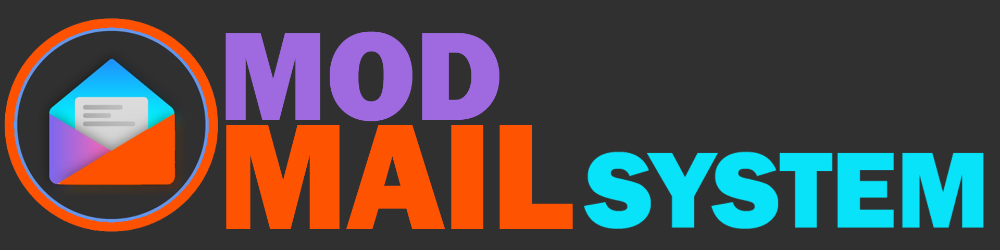
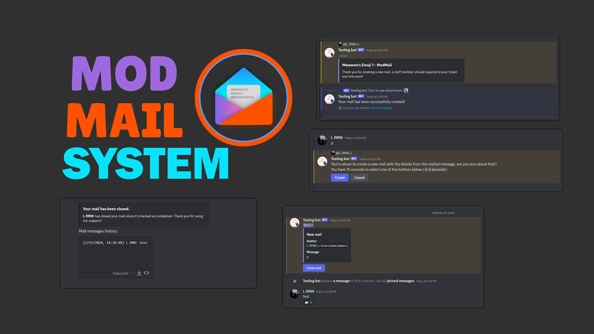

<br />
<p align="center">
  <a href="https://discord.gg/6EXgrmtkPX">
    
  </a>

  <h1 align="center">MOD MAIL SYSTEM DISCORD BOT</h1>

  <p align="center">Simple ModMail Discord bot designed for a small server and people that want to maintain their own ModMail bot in discord. ModMail is a bot that create a private space between moderator and user to address an issue by acting as a bridge between user DM channel and new temporary channel inside a thread server.
    <br />
    <br />
    <a href="https://discord.com/api/oauth2/authorize?client_id=928711702596423740&permissions=551940385840&response_type=code&redirect_uri=https%3A%2F%2Fdiscord.gg%2F6EXgrmtkPX&scope=guilds.join+bot+applications.commands">Invite Mewwme's Music</a>
    ·
    <a href="https://discord.gg/6EXgrmtkPX">Report Issues & Give Suggestions</a>
    ·
    <a href="https://discord.gg/mewwme">Support Server</a>
  </p>
</p>

## ✨ Features Command
- `/animated-avatar`: Set bot avatar using gif format.
- `/ban`: Ban a user from using the ModMail System.
- `/unban`: Unban a user from using the ModMail System.
- categories channel & logs channel `modmail` created and closed

## Disclaimer
This bot only support one pair of server per bot, one main server and one thread server.

## 🏆 UI Interface of bot


## 📋 Requirements
-  Node.js Version 16.6.0+ [Download](https://nodejs.org/en/download)
-  Discord Bot Token [Guide](https://discordjs.guide/preparations/setting-up-a-bot-application.html#creating-your-bot)
-  Git [Download](https://git-scm.com/downloads)

## 🛠️ Installation
```javascript
module.exports = {
    client: {
        token: process.env.BOT_TOKEN, // Your bot token (.env IS RECOMMENDED) https://discord.com/developers/applications/
        id: process.env.BOT_ID // Your bot ID
    },
    modmail: {
        ownerId: process.env.OWNER_ID, // Your bot owner ID
        guildId: process.env.SERVER_ID, // Your server ID
        categoryId: process.env.MODMAIL_CATEGORY_ID, // The modmail category ID
        staffRoles: [process.env.MODMAIL_STAFF_ROLES], // The modmail staff roles IDs
        mentionStaffRolesOnNewMail: true, // Mention staff roles when there is a new mail?
        color: '#7289DA' // The embed color Red, Green, Blue, or Color Hex Color Codes
    },
    setPresence: {
        activity1: `Love has a cost, and both of us lost`,
        activity2: `Mostly sleepless🌛`, // The modmail category ID
        activity3: `Mewwme's Everywhere`, // The modmail staff roles IDs
        type: 2, // # 0 = PLAYING, 1 = STREAMING, 2 = LISTENING, 3 = WATCHING, 4 = CUSTOM. 5 = COMPETING
        url: `https://www.youtube.com/watch?v=F-wbcMyeq4A`, // URL optional, only required for certain activity types 3
        status: 'dnd', // online, idle, dnd, invisible
    },
    logs: {
        webhookURL: process.env.WEBHOOK_URL, // The logging webhook URL (OPTIONAL) (.env IS RECOMMENDED)
    }
};
```
1. Check `config.js` and Change the name of **.env.example** to **.env** and fill in the required information.
2. run `npm install` to install the required packages.
3. run `npm run start` or `node .` to run the project bot.
4. **Enjoy ModMail**


Make sure to follow these steps carefully to set up your server for running the Mewwme music bot. If you encounter any issues, join [server discord](https://discord.gg/6EXgrmtkPX)

## ⚙️ Guide
For advanced installation and configuration guidance, feel free to discuss on our [Discord Server](https://discord.gg/6EXgrmtkPX)

---
